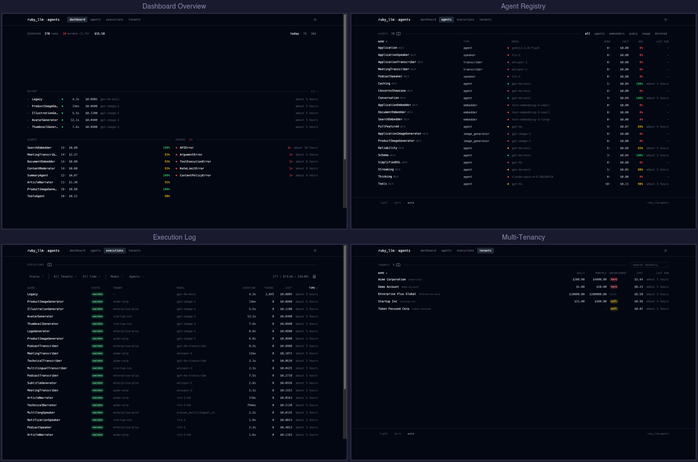

<picture>
  <source media="(prefers-color-scheme: dark)" srcset="./logo_dark.png">
  <source media="(prefers-color-scheme: light)" srcset="./logo_light.png">
  
</picture>

# RubyLLM::Agents

> **AI Agents:** For comprehensive documentation optimized for AI consumption, see [LLMS.txt](LLMS.txt)

> **Production-ready Rails engine for building, managing, and monitoring LLM-powered AI agents**

[](https://rubygems.org/gems/ruby_llm-agents)
[](https://www.ruby-lang.org)
[](https://rubyonrails.org)
[](https://opensource.org/licenses/MIT)
[](https://github.com/adham90/ruby_llm-agents/wiki)

Build intelligent AI agents in Ruby with a clean DSL, automatic execution tracking, cost analytics, budget controls, and a beautiful real-time dashboard. Supports **OpenAI GPT-4**, **Anthropic Claude**, **Google Gemini**, and more through [RubyLLM](https://github.com/crmne/ruby_llm).

## Why RubyLLM::Agents?

- **Rails-Native** - Seamlessly integrates with your Rails app: models, jobs, caching, and Hotwire
- **Production-Ready** - Built-in retries, model fallbacks, circuit breakers, and budget limits
- **Full Observability** - Track every execution with costs, tokens, duration, and errors
- **Workflow Orchestration** - Compose agents into pipelines, parallel tasks, and conditional routers
- **Zero Lock-in** - Works with any LLM provider supported by RubyLLM

## Features

| Feature | Description | Docs |
|---------|-------------|------|
| **Agent DSL** | Declarative configuration with model, temperature, parameters, description | [Agent DSL](https://github.com/adham90/ruby_llm-agents/wiki/Agent-DSL) |
| **Execution Tracking** | Automatic logging with token usage, cost analytics, and fallback tracking | [Tracking](https://github.com/adham90/ruby_llm-agents/wiki/Execution-Tracking) |
| **Cost Analytics** | Track spending by agent, model, tenant, and time period | [Analytics](https://github.com/adham90/ruby_llm-agents/wiki/Execution-Tracking) |
| **Reliability** | Automatic retries, model fallbacks, circuit breakers with block DSL | [Reliability](https://github.com/adham90/ruby_llm-agents/wiki/Reliability) |
| **Budget Controls** | Daily/monthly limits with hard and soft enforcement | [Budgets](https://github.com/adham90/ruby_llm-agents/wiki/Budget-Controls) |
| **Multi-Tenancy** | Per-tenant API keys, budgets, circuit breakers, and execution isolation | [Multi-Tenancy](https://github.com/adham90/ruby_llm-agents/wiki/Multi-Tenancy) |
| **Workflows** | Pipelines, parallel execution, conditional routers | [Workflows](https://github.com/adham90/ruby_llm-agents/wiki/Workflows) |
| **Async/Fiber** | Concurrent execution with Ruby fibers for high-throughput workloads | [Async](https://github.com/adham90/ruby_llm-agents/wiki/Async-Fiber) |
| **Dashboard** | Real-time Turbo-powered monitoring UI | [Dashboard](https://github.com/adham90/ruby_llm-agents/wiki/Dashboard) |
| **Streaming** | Real-time response streaming with TTFT tracking | [Streaming](https://github.com/adham90/ruby_llm-agents/wiki/Streaming) |
| **Conversation History** | Multi-turn conversations with message history | [Conversation History](https://github.com/adham90/ruby_llm-agents/wiki/Conversation-History) |
| **Attachments** | Images, PDFs, and multimodal support | [Attachments](https://github.com/adham90/ruby_llm-agents/wiki/Attachments) |
| **PII Redaction** | Automatic sensitive data protection | [Security](https://github.com/adham90/ruby_llm-agents/wiki/PII-Redaction) |
| **Content Moderation** | Input/output safety checks with OpenAI moderation API | [Moderation](https://github.com/adham90/ruby_llm-agents/wiki/Moderation) |
| **Embeddings** | Vector embeddings with batching, caching, and preprocessing | [Embeddings](https://github.com/adham90/ruby_llm-agents/wiki/Embeddings) |
| **Image Operations** | Generation, analysis, editing, pipelines with cost tracking | [Images](https://github.com/adham90/ruby_llm-agents/wiki/Image-Generation) |
| **Alerts** | Slack, webhook, and custom notifications | [Alerts](https://github.com/adham90/ruby_llm-agents/wiki/Alerts) |

## Quick Start

### Installation

```ruby
# Gemfile
gem "ruby_llm-agents"
```

```bash
bundle install
rails generate ruby_llm_agents:install
rails db:migrate
```

### Configure API Keys

```bash
# .env
OPENAI_API_KEY=sk-...
ANTHROPIC_API_KEY=sk-ant-...
GOOGLE_API_KEY=...
```

### Create Your First Agent

```bash
rails generate ruby_llm_agents:agent SearchIntent query:required
```

```ruby
# app/llm/agents/search_intent_agent.rb
module LLM
  class SearchIntentAgent < ApplicationAgent
    model "gpt-4o"
    temperature 0.0

    param :query, required: true

    def user_prompt
      "Extract search intent from: #{query}"
    end

    def schema
      @schema ||= RubyLLM::Schema.create do
        string :refined_query, description: "Cleaned search query"
        array :filters, of: :string, description: "Extracted filters"
      end
    end
  end
end
```

### Call the Agent

```ruby
result = LLM::SearchIntentAgent.call(query: "red summer dress under $50")

result.content        # => { refined_query: "red dress", filters: ["color:red", "price:<50"] }
result.total_cost     # => 0.00025
result.total_tokens   # => 150
result.duration_ms    # => 850
```

### Multi-Turn Conversations

Build chatbots and conversational agents with message history:

```ruby
result = ChatAgent.call(
  query: "What's my name?",
  messages: [
    { role: :user, content: "My name is Alice" },
    { role: :assistant, content: "Nice to meet you, Alice!" }
  ]
)
# => "Your name is Alice!"
```

See [Conversation History](https://github.com/adham90/ruby_llm-agents/wiki/Conversation-History) for more patterns.

### Embeddings

Generate vector embeddings for semantic search, RAG, and similarity matching:

```bash
rails generate ruby_llm_agents:embedder Document
```

```ruby
# app/llm/text/embedders/document_embedder.rb
module LLM
  module Text
    class DocumentEmbedder < ApplicationEmbedder
      model "text-embedding-3-small"
      dimensions 512
      batch_size 100
      cache_for 1.week

      # Optional: preprocess text before embedding
      def preprocess(text)
        text.strip.downcase.gsub(/\s+/, ' ')
      end
    end
  end
end
```

```ruby
# Single text embedding
result = LLM::Text::DocumentEmbedder.call(text: "Hello world")
result.vector       # => [0.123, -0.456, ...]
result.dimensions   # => 512
result.total_tokens # => 2

# Batch embedding
result = LLM::Text::DocumentEmbedder.call(texts: ["Hello", "World", "Ruby"])
result.vectors      # => [[...], [...], [...]]
result.count        # => 3

# With progress callback for large batches
LLM::Text::DocumentEmbedder.call(texts: large_array) do |batch_result, index|
  puts "Processed batch #{index + 1}"
end
```

Features:
- **Configurable dimensions** - Reduce dimensions for efficient storage
- **Batch processing** - Embed multiple texts in optimized API calls
- **Caching** - Cache embeddings to reduce API costs
- **Preprocessing** - Clean and normalize text before embedding
- **Execution tracking** - All embeddings logged with tokens and costs

See [Embeddings](https://github.com/adham90/ruby_llm-agents/wiki/Embeddings) for more patterns.

### Image Operations

Comprehensive image capabilities with generation, analysis, editing, and pipelines:

```bash
# Generate image generators, analyzers, pipelines, and more
rails generate ruby_llm_agents:image_generator Logo
rails generate ruby_llm_agents:image_analyzer Product
rails generate ruby_llm_agents:background_remover Photo
rails generate ruby_llm_agents:image_pipeline Ecommerce --steps generate,upscale,analyze
```

```ruby
# Image Generation - create images from prompts
result = LLM::Image::LogoGenerator.call(prompt: "tech startup logo")
result.url          # => "https://..."
result.save("logo.png")

# Image Analysis - extract captions, tags, objects, colors
result = LLM::Image::ProductAnalyzer.call(image: "product.jpg")
result.caption      # => "Red sneaker on white background"
result.tags         # => ["sneaker", "red", "footwear"]
result.colors       # => [{ hex: "#FF0000", percentage: 30 }]

# Background Removal - extract subjects with transparency
result = LLM::Image::PhotoBackgroundRemover.call(image: "portrait.jpg")
result.save("portrait_transparent.png")

# Image Pipelines - chain multiple operations
result = LLM::Image::EcommercePipeline.call(
  prompt: "professional laptop photo",
  high_quality: true
)
result.final_image   # => Final processed image
result.total_cost    # => Combined cost of all steps
result.step(:analyze).tags  # => Access individual step results
```

Features:
- **8 image operation classes** - Generator, Analyzer, Editor, Transformer, Upscaler, Variator, BackgroundRemover, Pipeline
- **Prompt templates** - Consistent styling with preset templates
- **Content policy** - Validate prompts with configurable safety levels
- **Cost tracking** - Dynamic pricing with execution logging
- **Image Pipelines** - Chain operations into automated workflows
- **ActiveStorage** - Attach images directly to Rails models

See [Image Operations](https://github.com/adham90/ruby_llm-agents/wiki/Image-Generation) for full documentation.

## Documentation

> **Note:** Wiki content lives in the [`wiki/`](wiki/) folder. To sync changes to the [GitHub Wiki](https://github.com/adham90/ruby_llm-agents/wiki), run `./scripts/sync-wiki.sh`.

| Guide | Description |
|-------|-------------|
| [Getting Started](https://github.com/adham90/ruby_llm-agents/wiki/Getting-Started) | Installation, configuration, first agent |
| [Agent DSL](https://github.com/adham90/ruby_llm-agents/wiki/Agent-DSL) | All DSL options: model, temperature, params, caching, description |
| [Reliability](https://github.com/adham90/ruby_llm-agents/wiki/Reliability) | Retries, fallbacks, circuit breakers, timeouts, reliability block |
| [Workflows](https://github.com/adham90/ruby_llm-agents/wiki/Workflows) | Pipelines, parallel execution, routers |
| [Budget Controls](https://github.com/adham90/ruby_llm-agents/wiki/Budget-Controls) | Spending limits, alerts, enforcement |
| [Multi-Tenancy](https://github.com/adham90/ruby_llm-agents/wiki/Multi-Tenancy) | Per-tenant budgets, isolation, configuration |
| [Async/Fiber](https://github.com/adham90/ruby_llm-agents/wiki/Async-Fiber) | Concurrent execution with Ruby fibers |
| [Testing Agents](https://github.com/adham90/ruby_llm-agents/wiki/Testing-Agents) | RSpec patterns, mocking, dry_run mode |
| [Error Handling](https://github.com/adham90/ruby_llm-agents/wiki/Error-Handling) | Error types, recovery patterns |
| [Moderation](https://github.com/adham90/ruby_llm-agents/wiki/Moderation) | Content moderation for input/output safety |
| [Embeddings](https://github.com/adham90/ruby_llm-agents/wiki/Embeddings) | Vector embeddings, batching, caching, preprocessing |
| [Image Generation](https://github.com/adham90/ruby_llm-agents/wiki/Image-Generation) | Text-to-image, templates, content policy, cost tracking |
| [Dashboard](https://github.com/adham90/ruby_llm-agents/wiki/Dashboard) | Setup, authentication, analytics |
| [Production](https://github.com/adham90/ruby_llm-agents/wiki/Production-Deployment) | Deployment best practices, background jobs |
| [API Reference](https://github.com/adham90/ruby_llm-agents/wiki/API-Reference) | Complete class documentation |
| [Examples](https://github.com/adham90/ruby_llm-agents/wiki/Examples) | Real-world use cases and patterns |

## Reliability Features

Build resilient agents with built-in fault tolerance:

```ruby
# app/llm/agents/reliable_agent.rb
module LLM
  class ReliableAgent < ApplicationAgent
    model "gpt-4o"
    description "A resilient agent with automatic retries and fallbacks"

    # Option 1: Individual DSL methods
    retries max: 3, backoff: :exponential
    fallback_models "gpt-4o-mini", "claude-3-5-sonnet"
    circuit_breaker errors: 10, within: 60, cooldown: 300
    total_timeout 30

    # Option 2: Grouped reliability block (equivalent to above)
    reliability do
      retries max: 3, backoff: :exponential
      fallback_models "gpt-4o-mini", "claude-3-5-sonnet"
      circuit_breaker errors: 10, within: 60, cooldown: 300
      total_timeout 30
    end

    param :query, required: true

    def user_prompt
      query
    end
  end
end
```

### Enhanced Result Object

The result object provides detailed execution metadata:

```ruby
result = LLM::ReliableAgent.call(query: "test")

# Basic response
result.content           # => { ... }
result.success?          # => true

# Reliability info
result.attempts_count    # => 2 (if retry occurred)
result.used_fallback?    # => true (if fallback model used)
result.chosen_model_id   # => "gpt-4o-mini" (actual model used)

# Cost & timing
result.total_cost        # => 0.00025
result.total_tokens      # => 150
result.duration_ms       # => 850
```

## Workflow Orchestration

Compose agents into complex workflows:

```ruby
# Sequential pipeline - each step's output feeds the next
class ContentPipeline < RubyLLM::Agents::Workflow::Pipeline
  timeout 60.seconds
  max_cost 1.00

  step :classify, agent: ClassifierAgent
  step :enrich,   agent: EnricherAgent
  step :format,   agent: FormatterAgent, optional: true
end

result = ContentPipeline.call(text: data)
result.steps[:classify].content  # Individual step result
result.total_cost                # Sum of all steps

# Parallel execution - run agents concurrently
class AnalysisPipeline < RubyLLM::Agents::Workflow::Parallel
  fail_fast false  # Continue even if a branch fails

  branch :sentiment, agent: SentimentAgent
  branch :entities,  agent: EntityAgent
  branch :summary,   agent: SummaryAgent
end

result = AnalysisPipeline.call(text: content)
result.branches[:sentiment].content  # Individual branch result

# Conditional routing - dispatch based on classification
class SupportRouter < RubyLLM::Agents::Workflow::Router
  classifier_model "gpt-4o-mini"

  route :support, to: SupportAgent, description: "Technical support issues"
  route :sales,   to: SalesAgent,   description: "Sales and pricing questions"
  route :default, to: GeneralAgent
end

result = SupportRouter.call(message: user_input)
result.routed_to  # :support, :sales, or :default
```

## Async/Fiber Concurrency

Run multiple agents concurrently with minimal resources using Ruby's Fiber scheduler:

```ruby
# Add async gem to Gemfile
gem 'async'
```

```ruby
require 'async'

# Run agents concurrently - non-blocking I/O
Async do
  results = RubyLLM::Agents::Async.batch([
    [SentimentAgent, { input: "I love this!" }],
    [SummaryAgent, { input: "Long text..." }],
    [CategoryAgent, { input: "Product review" }]
  ], max_concurrent: 10)
end

# Process large collections efficiently
Async do
  results = RubyLLM::Agents::Async.each(texts, max_concurrent: 20) do |text|
    AnalyzerAgent.call(input: text)
  end
end
```

Benefits:
- **100x less memory** - Fibers use ~10KB vs ~1MB per thread
- **Shared connections** - Single database connection for all fibers
- **Auto-detection** - Parallel workflows automatically use fibers in async context
- **Non-blocking retries** - Backoff delays don't block other operations

See [Async/Fiber](https://github.com/adham90/ruby_llm-agents/wiki/Async-Fiber) for more patterns.

## Cost & Budget Controls

Track and limit LLM spending:

```ruby
# config/initializers/ruby_llm_agents.rb
RubyLLM::Agents.configure do |config|
  config.budgets = {
    global_daily: 100.0,      # $100/day limit
    global_monthly: 2000.0,   # $2000/month limit
    per_agent_daily: {
      "ExpensiveAgent" => 50.0
    },
    enforcement: :hard        # Block when exceeded
  }

  config.alerts = {
    on_events: [:budget_soft_cap, :budget_hard_cap, :breaker_open],
    slack_webhook_url: ENV['SLACK_WEBHOOK_URL']
  }
end
```

## Dashboard

Mount the real-time monitoring dashboard:

```ruby
# config/routes.rb
mount RubyLLM::Agents::Engine => "/agents"
```



Features:
- Execution history with filtering and search
- Cost analytics by agent, model, and time period
- Performance trends and charts
- Token usage breakdowns
- Error tracking and debugging

## Requirements

- **Ruby** >= 3.1.0
- **Rails** >= 7.0
- **RubyLLM** >= 1.0

## Contributing

Bug reports and pull requests are welcome at [GitHub](https://github.com/adham90/ruby_llm-agents).

1. Fork the repository
2. Create your feature branch (`git checkout -b my-feature`)
3. Commit your changes (`git commit -am 'Add feature'`)
4. Push to the branch (`git push origin my-feature`)
5. Create a Pull Request

## License

The gem is available as open source under the [MIT License](https://opensource.org/licenses/MIT).

## Credits

Built with love by [Adham Eldeeb](https://github.com/adham90)

Powered by [RubyLLM](https://github.com/crmne/ruby_llm)
